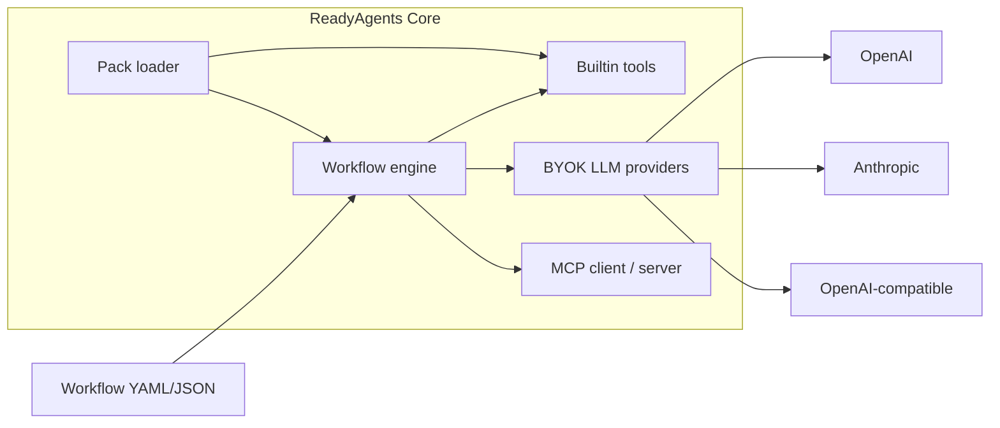

# ReadyAgents Core

<!-- mcp-name: io.github.readyagentsdev/readyagents -->
ReadyAgents is a free, self-hosted Apache-2.0 local one-shot agent workflow engine plus MCP toolkit: clone it, bring your own keys; always-on packs are waitlisted and not for sale. **1.0** means every run can be recorded, replayed offline, forked, diffed, and frozen into a regression test — with a written stability contract.

Site: [readyagents.dev](https://readyagents.dev). Repo: [github.com/readyagentsdev/readyagents-core](https://github.com/readyagentsdev/readyagents-core).

Tried it? Open an [I-ran-this](https://github.com/readyagentsdev/readyagents-core/issues/new?template=i-ran-this.md) issue. We are not launching. We are listening.

This repository is the free core. You keep the provider account and the bill. Install with `pip install readyagentsdev`, or from this clone.

## 60-second start

Requires **Python 3.11–3.14** on Linux, macOS, or Windows. Current version is **1.9.0**. Install with `pip install readyagentsdev`, or from this clone.

```bash
git clone https://github.com/readyagentsdev/readyagents-core.git
cd readyagents-core
python -m venv .venv
source .venv/bin/activate   # Windows: .venv\Scripts\activate
pip install -e .
readyagents run examples/calc_pipeline.yaml
readyagents runs list
readyagents doctor
```

`readyagents run examples/calc_pipeline.json` is the same graph.

Or from PyPI (the wheel does not ship `examples/`):

```bash
pip install readyagentsdev
readyagents new my-flow
```

HITL next: [docs/first-ten-minutes.md](docs/first-ten-minutes.md).

## What it does

- Define agent workflows as YAML or JSON (nodes + edges)
- Run **agent**, **tool**, **condition**, **transform**, **approval**, **parallel**, **include**, **foreach**, and **a2a** nodes. Agent nodes may declare a `tools:` allowlist for a bounded tool-use loop.
- Persist after every node and **resume** a paused or failed run from the last successful node
- Inspect past runs: `readyagents runs list` / `show` / `replay` / `report` (local HTML)
- Record, replay offline, fork, diff, and freeze a run into an eval fixture ([time machine](docs/time-machine.md))
- Optional agent firewall: taint, tool policy, MCP pinning ([security model](docs/security-model.md), [policy](docs/policy.md)) — defence in depth, not a solution to prompt injection
- Scaffold a starter: `readyagents new my-flow` (`basic`, `approval`, `research`, `pipeline`, `review`, `foreach`, `agent-tools`, `gated`)
- Builtin tools with **zero extra servers**: `now`, `calc`, `json_get`, `list_dir`, `read_file`, `write_file`, optional `http_get`
- Small governed connector set (`rest`, `sql`, `object_storage`, `message`, `ingest`) plus `readyagents connectors` catalog — [connectors](docs/connectors.md)
- Optional [MCP](https://modelcontextprotocol.io) client and server (`readyagents mcp serve`, `readyagents mcp probe`) with official tasks and MRTR approvals
- Optional [A2A](docs/a2a.md) serve/probe and `type: a2a` delegation (projection over the run record; remote content untrusted; not certification)
- Extra node types and tools via Python entry points (`readyagents.packs`)
- Per-node token/cost, budgets, `--estimate` / `--max-spend` caps, local spend ledger, model fallback, JSON logs
- External approval injection (`readyagents decide`) and outbound pause notify
- Secrets / RBAC / PII-redaction hooks and an append-only, hash-chained audit trail; `readyagents evidence` writes a local pack of a run — evidence, not legal compliance or certification ([compliance](docs/compliance.md))
- Pydantic `output_schema` on agent nodes; opt-in local LLM cache
- `readyagents.testing` helpers, recorded LLM mocks, and a tiny eval harness

## Architecture



## CLI

| Command | Purpose |
| --- | --- |
| `readyagents init` | Write `.env` from `.env.example` if missing |
| `readyagents new [name] [--template basic\|approval\|research\|pipeline\|review\|foreach\|agent-tools\|gated]` | Scaffold workflow + README + `.env.example` + local JSON Schema |
| `readyagents validate PATH` | Schema-validate a workflow (source-located errors on failure) |
| `readyagents schema` | Print/write/check the generated workflow JSON Schema |
| `readyagents eval PATH` | Score a keyless fixture suite (exit 0/1) |
| `readyagents run PATH [--input KEY=VALUE] [--dry-run] [--approve NODE] [--reject NODE] [--decision-file FILE] [--actor NAME] [--pack PATH] [--policy PATH] [--estimate] [--max-spend USD] [--max-tokens N] [--label KEY=VALUE] [--sovereign]` | Execute (or `--estimate` without running) |
| `readyagents attest RUN_ID` | Data-residency attestation (technical evidence, not legal compliance) |
| `readyagents bundle --out DIR` | Offline wheel set for `pip install --no-index --find-links` |
| `readyagents resume RUN_ID [--approve NODE] [--reject NODE] [--decision-file FILE] [--policy PATH]` | Resume a paused or failed run |
| `readyagents policy check PATH` | Validate a firewall policy file (fail closed) |
| `readyagents policy explain PATH [--policy PATH]` | Show which tools each node may call and why |
| `readyagents evidence RUN_ID [--out DIR]` | Local evidence pack (not a compliance certificate) |
| `readyagents audit verify [--file PATH]` | Walk the hash-chained audit trail |
| `readyagents spend [--since DATE] [--by day\|workflow\|model\|actor\|label]` | Aggregate the local spend ledger |
| `readyagents graph PATH` | Deterministic Mermaid routing (executes nothing) |
| `readyagents decide RUN_ID [--file FILE \| --node ID --decision approve] [--token-file JWT] [--actor NAME] [--reason TEXT]` | Inject an approval; `--actor` stays the default, `--token-file` identifies |
| `readyagents approvals list [--role ROLE] [--actor NAME] [--expiring-within 1h]` | Queue of paused gates the caller may see |
| `readyagents delegate --from A --to B --until TS [--scope ROLE]` | Time-bounded, single-hop, revocable approval delegation |
| `readyagents delegations list \| revoke ID` | List or revoke local delegations |
| `readyagents identity verify --token-file JWT` | Verify an assertion against local trust anchors |
| `readyagents identity whoami` | Workload fingerprint (never the private key) |
| `readyagents runs list` | List persisted runs |
| `readyagents runs show RUN_ID` | Node timeline + stored state (`inspect` is an alias) |
| `readyagents runs report RUN_ID` | Local HTML summary of a run |
| `readyagents runs replay RUN_ID` | New run from stored inputs |
| `readyagents runs delete RUN_ID --yes` | Delete one local run record |
| `readyagents runs gc --yes` | Prune succeeded/failed/cancelled runs (paused kept; in-window records refused unless `--override-retention`) |
| `readyagents mcp serve` | Stdio MCP server (builtin tools); `--json` prints protocol versions |
| `readyagents mcp probe URL` | Read-only `server/discover` diagnostic (never calls a tool) |
| `readyagents a2a serve PATH` | Foreground A2A door for one workflow (loopback by default) |
| `readyagents a2a card PATH` | Deterministic Agent Card (no network) |
| `readyagents a2a probe URL` | Read-only remote card diagnostic (no secret values) |
| `readyagents packs [--pack PATH]` | List installed / local packs |
| `readyagents doctor` | Read-only platform / extras / permissions / loopback / run-store / sovereign diagnostic |
| `readyagents version` | Print version |

## Examples (no keys unless noted)

| File | What it shows |
| --- | --- |
| `examples/calc_pipeline.yaml` | Builtin tools, transform, condition |
| `examples/calc_pipeline.json` | Same graph as `calc_pipeline.yaml` |
| `examples/approval_gate.yaml` | Human-in-the-loop pause / resume |
| `examples/ollama_local.yaml` | Keyless loopback OpenAI-compat path (no live model) |
| `examples/quorum_gate.yaml` | Two-approver gate (keyless) |
| `examples/expiring_gate.yaml` | Lazy deadline, `on_expire: reject` (keyless) |
| `examples/multi_gate.yaml` | Two sequential approval gates |
| `examples/fanout_gate.yaml` | Parallel branches + approval |
| `examples/include_demo.yaml` | Sub-workflow `include` |
| `examples/composed_gate.yaml` | Include + parallel + approval |
| `examples/research_brief.yaml` | Agent node (needs a key) |
| `examples/support_triage.yaml` | Classify then branch (needs a key) |
| `examples/code_review.yaml` | `read_file` + review (needs a key) |
| `examples/agent_tools.yaml` | Agent `tools: [calc]` (needs a key; `--dry-run` is keyless) |
| `examples/foreach_calc.yaml` | Sequential foreach + `calc` (no keys) |
| `examples/policy_gated.yaml` | Policy gate on tainted `write_file` (no keys) |
| `examples/readyagents.policy.yaml` | Starter firewall policy |
| `examples/json_mutate.yaml` | `json_set` / `json_merge` (no keys) |
| `examples/list_dir.yaml` | Builtin `list_dir` (no keys, no MCP, no Node) |
| `examples/eval/pass.yaml` | Keyless `readyagents eval` fixture suite |
| `examples/a2a_delegate.yaml` | `type: a2a` dry-run (no network) |
| `examples/connector_demo.yaml` | Local `--pack` connector (`examples/packs/connector_pack.py`) |
| `examples/gated_write.yaml` | Approval then `write_file` (no keys) |

## Docs

- [Why ReadyAgents?](docs/why-readyagents.md)
- [Getting started](docs/getting-started.md)
- [First ten minutes](docs/first-ten-minutes.md)
- [Concepts](docs/concepts.md)
- [Configuration (BYOK)](docs/configuration.md)
- [Workflows](docs/workflows.md)
- [Authoring (JSON Schema, editors, located errors)](docs/authoring.md)
- [MCP](docs/mcp.md)
- [A2A](docs/a2a.md) (untrusted remote content; delegation can exfiltrate; not certification)
- [Packs](docs/packs.md)
- [Supply-chain trust](docs/supply-chain.md) (signatures prove origin, not safety)
- [Continuous pack](docs/continuous-pack.md) (optional, separate distribution)
- [Platform support](docs/platform-support.md)
- [CLI](docs/cli.md)
- [Compliance evidence](docs/compliance.md) (Articles 12–14 mapping; not certification)
- [Observability](docs/observability.md)
- [Changelog](CHANGELOG.md)
- [Release notes 0.8.0](RELEASE_NOTES.md)

## Install extras

LLM and MCP extras are optional.

```bash
pip install "readyagentsdev[openai]"
pip install "readyagentsdev[anthropic]"
pip install "readyagentsdev[mcp]"
pip install "readyagentsdev[all]"
```

From a clone, the same extras are `pip install -e ".[openai]"` (and `anthropic` / `mcp` / `all`).
The optional `[otel]` extra is **not** included in `[all]`; it starts no collector (see [observability.md](docs/observability.md)).
The optional `[sign]` extra (Ed25519 artifact signatures) and `[jwt]` extra are
also **not** in `[all]`. Unsigned default runs never import them.

Then `cp .env.example .env` and paste your own keys. Core workflows that only use builtin tools do **not** need extras, keys, or Node.js.

```bash
docker compose run --rm readyagents run examples/calc_pipeline.yaml
make smoke
```


## What is not in this repository

Always-on packs are waitlisted and not for sale.

Always-on / continuous workers are not in Core. The optional `readyagents-pack-continuous` distribution (separate repository, not a Core extra) can run configured workflows from an explicit foreground command. Installing Core still starts no scheduler or listener.

Hosted control plane. Hosted recovery and remote run stores. SSO, multi-tenant teams, billing.

The core has persist, resume, and approval pauses for a local one-shot. It does not run always-on.

## License

Apache License 2.0. See [LICENSE](LICENSE).

## Security

Please report vulnerabilities as described in [SECURITY.md](SECURITY.md). Public contact: [info@readyagents.dev](mailto:info@readyagents.dev). Do not commit API keys. Local operator files such as `.env` are gitignored.
