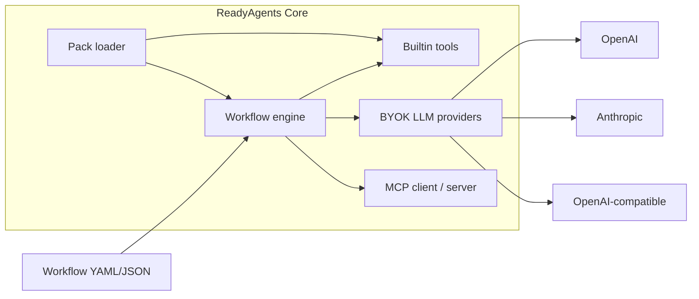

# ReadyAgents Core

<!-- mcp-name: io.github.readyagentsdev/readyagents -->
**ReadyAgents runs YAML agent workflows locally. Every node is checkpointed, so a run pauses for human approval, resumes from where it stopped, and replays offline as a regression test. Your keys, your machine, no daemon.**

Site: [readyagents.dev](https://readyagents.dev). Repo: [github.com/readyagentsdev/readyagents-core](https://github.com/readyagentsdev/readyagents-core).

Tried it? Open an [I-ran-this](https://github.com/readyagentsdev/readyagents-core/issues/new?template=i-ran-this.md) issue. We are not launching. We are listening.

This repository is the free core. You keep the provider account and the bill. Install with `pip install readyagentsdev`, or from this clone.

## 60-second start

Requires **Python 3.11–3.14** on Linux, macOS, or Windows. Current version is **2.0.6**. Install with `pip install readyagentsdev`, or from this clone. The `2` versions the [core contract](docs/stability.md#what-the-version-number-means) only; extras carry their own maturity tiers.

```bash
pip install readyagentsdev
readyagents new my-flow
readyagents run my-flow/workflow.yaml
readyagents runs list
```

The wheel ships the example workflows too — no clone needed:

```bash
readyagents new f --from-example calc_pipeline
readyagents run f/workflow.yaml
```

`readyagents new --list-examples` shows all of them.

Or from a clone:

```bash
git clone https://github.com/readyagentsdev/readyagents-core.git
cd readyagents-core
python -m venv .venv
source .venv/bin/activate   # Windows: .venv\Scripts\activate
pip install -e .
readyagents run examples/calc_pipeline.yaml
readyagents runs list
readyagents doctor
```

`readyagents run examples/calc_pipeline.json` is the same graph.

HITL next: [docs/first-ten-minutes.md](docs/first-ten-minutes.md).

## What it does

- Define agent workflows as YAML or JSON (nodes + edges)
- Run **agent**, **tool**, **condition**, **transform**, **approval**, **parallel**, **include**, and **foreach** nodes. Agent nodes may declare a `tools:` allowlist for a bounded tool-use loop.
- Persist after every node and **resume** a paused or failed run from the last successful node
- Inspect past runs: `readyagents runs list` / `show` / `replay` / `fork` / `diff` / `freeze` / `report` (local HTML)
- Scaffold a starter: `readyagents new my-flow` (`basic`, `approval`, `research`, `pipeline`, `review`, `foreach`, `agent-tools`, `gated`)
- Builtin tools with **zero extra servers**: `now`, `calc`, `json_get`, `list_dir`, `read_file`, `write_file`
- MCP client and server (`readyagents mcp serve`, `readyagents mcp probe`) with official tasks and MRTR approvals
- Policy, spend ledger, budgets and caps: per-node token/cost, `--estimate` / `--max-spend` caps, model fallback, JSON logs

Beyond the core, 40+ opt-in extras ship in the same install — teams, studio, browser, knowledge, distillation, registry, environments and more. Each is listed with its maturity tier and its limits in [docs/extras.md](docs/extras.md). None of them is required, and none of them changes how the core behaves.

The agent firewall (taint, tool policy, MCP pinning — [security model](docs/security-model.md), [policy](docs/policy.md)) is defence in depth, not a solution to prompt injection.

## Architecture



## CLI

| Command | Purpose |
| --- | --- |
| `readyagents init` | Write `.env` from `.env.example` if missing |
| `readyagents new [name] [--template basic\|approval\|research\|pipeline\|review\|foreach\|agent-tools\|gated] [--from-example NAME] [--list-examples]` | Scaffold workflow + README + `.env.example` + local JSON Schema, or copy a shipped example |
| `readyagents import SOURCE PATH [--out DIR] [--explain SOURCE]` | Import n8n / LangGraph / CrewAI / trigger-action exports (structural translation only) |
| `readyagents validate PATH` | Schema-validate a workflow (source-located errors on failure) |
| `readyagents schema` | Print/write/check the generated workflow JSON Schema |
| `readyagents eval PATH` | Score a keyless fixture suite (exit 0/1) |
| `readyagents simulate PATH [...]` | Declaration-driven cases scored with eval; distinct failures frozen |
| `readyagents optimize PATH --eval SUITE` | Reflective prompt optimization against your eval suite |
| `readyagents prompts list` / `show` / `history` / `diff` / `rollback` | Versioned prompts beside the workflow; rollback restores exactly |
| `readyagents env status` / `history` / `diff` / `deploy` | Declared environments and pinned releases |
| `readyagents registry scan` / `annotate` / `check` / `list` / `show` / `stats` / `card` / `export` | Local agent inventory from declared roots (Annex VIII export is a draft) |
| `readyagents distill plan` / `dataset` / `train` / `evaluate` / `promote` | Local one-node adapters from consented runs (pack trains; holdout required) |
| `readyagents promote PATH --from SRC --to DST` | Copy a source pin onto a target after eval/fixture/bench/health/approval gates |
| `readyagents rollback --env NAME` | Restore the previous release atomically; never auto-forwards |
| `readyagents feedback export` / `stats` | Consent-gated correction datasets (production data) |
| `readyagents run PATH [--input KEY=VALUE] [--dry-run] [--approve NODE] [--reject NODE] [--decision-file FILE] [--actor NAME] [--pack PATH] [--policy PATH] [--estimate] [--max-spend USD] [--max-tokens N] [--label KEY=VALUE] [--sovereign] [--stream] [--env NAME]` | Execute (or `--estimate` without running). `--env` runs a pinned release. `--stream` is opt-in |
| `readyagents batch PATH --input-file FILE [--concurrency N] [--max-spend USD] [--out FILE]` | Foreground: one workflow, many JSONL/CSV rows (opt-in) |
| `readyagents attest RUN_ID` | Data-residency attestation (technical evidence, not legal compliance) |
| `readyagents bundle --out DIR` | Offline wheel set for `pip install --no-index --find-links` |
| `readyagents resume RUN_ID [--approve NODE] [--reject NODE] [--decision-file FILE] [--policy PATH]` | Resume a paused or failed run |
| `readyagents wake` | Evaluate wait conditions (lazy; starts no timer or daemon) |
| `readyagents event` | Inject a signed event (unsigned events are refused) |
| `readyagents policy check PATH` | Validate a firewall policy file (fail closed) |
| `readyagents policy explain PATH [--policy PATH]` | Show which tools each node may call and why |
| `readyagents evidence RUN_ID [--out DIR]` | Local evidence pack |
| `readyagents audit verify [--file PATH]` | Walk the hash-chained audit trail |
| `readyagents spend [--since DATE] [--by day\|workflow\|model\|actor\|label]` | TokenOps: aggregate the local spend ledger (informational vs the provider invoice) |
| `readyagents graph PATH` | Deterministic Mermaid routing (executes nothing) |
| `readyagents decide RUN_ID [--file FILE \| --node ID --decision approve] [--token-file JWT] [--actor NAME] [--reason TEXT]` | Inject an approval; `--actor` stays the default, `--token-file` identifies |
| `readyagents approvals list [--role ROLE] [--actor NAME] [--expiring-within 1h]` | Queue of paused gates the caller may see |
| `readyagents delegate --from A --to B --until TS [--scope ROLE]` | Time-bounded, single-hop, revocable approval delegation |
| `readyagents delegations list \| revoke ID` | List or revoke local delegations |
| `readyagents identity verify --token-file JWT` | Verify an assertion against local trust anchors |
| `readyagents identity whoami` | Workload fingerprint (never the private key) |
| `readyagents runs list` | List persisted runs |
| `readyagents runs show RUN_ID` | Node timeline + stored state (`inspect` is an alias) |
| `readyagents runs report RUN_ID` | Local HTML summary of a run |
| `readyagents runs replay RUN_ID` | New run from stored inputs |
| `readyagents runs delete RUN_ID --yes` | Delete one local run record |
| `readyagents runs gc --yes` | Prune succeeded/failed/cancelled runs (paused kept; in-window records refused unless `--override-retention`) |
| `readyagents runs fork` / `diff` / `freeze` / `migrate` | Time machine: fork a run, diff two, freeze a cassette, migrate JSON→SQLite |
| `readyagents connectors list` / `show` / `test` | Small governed catalog (`rest`, `sql`, `object_storage`, `message`, `ingest`) — not 500 SaaS |
| `readyagents sign` / `verify` / `lock` / `sbom` / `trust` | Supply-chain: signatures prove origin, not safety |
| `readyagents approvals serve` | Foreground localhost approval page |
| `readyagents studio [--port 8790] [--open] [--read-only]` | Foreground localhost canvas and run inspector |
| `readyagents models list` / `show` / `route --explain` | Dry model catalog and routing explain (no provider call) |
| `readyagents mcp serve` | Stdio MCP server (builtin tools); `--json` prints protocol versions |
| `readyagents mcp probe URL` | Read-only `server/discover` diagnostic (never calls a tool) |
| `readyagents a2a serve PATH` | Foreground A2A door for one workflow (loopback by default) |
| `readyagents a2a card PATH` | Deterministic Agent Card (no network) |
| `readyagents a2a probe URL` | Read-only remote card diagnostic (no secret values) |
| `readyagents memory list` / `show` / `search` / `forget` / `export` | Local scoped memory (offline except optional embeddings) |
| `readyagents knowledge ...` | Ingest, sync, cite, and forget knowledge documents (foreground only) |
| `readyagents table ...` | Inspect intermediate tables: head, schema, stats |
| `readyagents triggers ...` | Inspect declared triggers, dry-run mappings, list events (starts no listener) |
| `readyagents skills ...` | Install, list, export, and remove Agent Skills (open format; no marketplace) |
| `readyagents agents-md` | Emit project context: how to run, validate, and test workflows here |
| `readyagents package ...` | Build, install, and catalog workflow packages (review-before-install) |
| `readyagents health` | Cluster failures by fingerprint over the run store (no daemon, no telemetry) |
| `readyagents bench ...` | Offline-by-default benchmark suite with labelled engine vs live timing |
| `readyagents sessions ...` | List, show, close, replay, and freeze conversational sessions (turns are runs) |
| `readyagents serve ...` | Foreground loopback surfaces (stops with the process) |
| `readyagents packs [--pack PATH]` | List installed / local packs |
| `readyagents doctor` | Read-only platform / extras / permissions / loopback / run-store / sovereign diagnostic |
| `readyagents version` | Print version |

## Examples (no keys unless noted)

| File | What it shows |
| --- | --- |
| `examples/calc_pipeline.yaml` | Builtin tools, transform, condition |
| `examples/calc_pipeline.json` | Same graph as `calc_pipeline.yaml` |
| `examples/approval_gate.yaml` | Human-in-the-loop pause / resume |
| `examples/ollama_local.yaml` | Keyless loopback OpenAI-compat path (no live model) |
| `examples/quorum_gate.yaml` | Two-approver gate (keyless) |
| `examples/expiring_gate.yaml` | Lazy deadline, `on_expire: reject` (keyless) |
| `examples/multi_gate.yaml` | Two sequential approval gates |
| `examples/fanout_gate.yaml` | Parallel branches + approval |
| `examples/include_demo.yaml` | Sub-workflow `include` (`new --from-example`) |
| `examples/composed_gate.yaml` | Include + parallel + approval (`new --from-example`) |
| `examples/research_brief.yaml` | Agent node (needs a key) |
| `examples/support_triage.yaml` | Classify then branch (needs a key) |
| `examples/code_review.yaml` | `read_file` + review (needs a key) |
| `examples/agent_tools.yaml` | Agent `tools: [calc]` (needs a key; `--dry-run` is keyless) |
| `examples/foreach_calc.yaml` | Sequential foreach + `calc` (no keys) |
| `examples/policy_gated.yaml` | Policy gate on tainted `write_file` (no keys) |
| `examples/readyagents.policy.yaml` | Starter firewall policy |
| `examples/json_mutate.yaml` | `json_set` / `json_merge` (no keys) |
| `examples/table_pipeline.yaml` | `type: table` + `type: classify` (validate keyless) |
| `examples/list_dir.yaml` | Builtin `list_dir` (no keys, no MCP, no Node) |
| `examples/eval/pass.yaml` | Keyless `readyagents eval` fixture suite |
| `examples/a2a_delegate.yaml` | `type: a2a` dry-run (no network) |
| `examples/memory_triage.yaml` | `type: memory` write then search (keyless) |
| `examples/code_reshape.yaml` | `type: code` JSON in/out (keyless, subprocess) |
| `examples/batch_echo.yaml` | Keyless `readyagents batch` row echo (`batch_rows.jsonl` / `.csv`) |
| `examples/connector_rest.yaml` | Keyless `rest` connector against a local fixture |
| `examples/connector_demo.yaml` | Local `--pack` connector (`examples/packs/connector_pack.py`) |
| `examples/gated_write.yaml` | Approval then `write_file` (no keys) |
| `examples/env/echo.yaml` | Keyless env deploy + `run --env` (`examples/env/readyagents.env.yaml`) |

## Docs

- [Why ReadyAgents?](docs/why-readyagents.md)
- [Getting started](docs/getting-started.md)
- [First ten minutes](docs/first-ten-minutes.md)
- [Concepts](docs/concepts.md)
- [Configuration (BYOK)](docs/configuration.md)
- [Workflows](docs/workflows.md)
- [Authoring (JSON Schema, editors, located errors)](docs/authoring.md)
- [Connectors](docs/connectors.md) (small catalog; write-shaped ops gate by default)
- [Sovereign mode](docs/sovereign.md) (in-process egress refuse, not an OS sandbox)
- [Cost / TokenOps](docs/cost.md) (informational vs the provider invoice)
- [Time machine](docs/time-machine.md) (record / replay / fork / diff / freeze)
- [MCP](docs/mcp.md) · [MCP paste catalog](docs/mcp-plugs.md)
- [A2A](docs/a2a.md) (untrusted remote content; delegation can exfiltrate; not certification)
- [Memory](docs/memory.md) (untrusted; delayed injection and scope escape)
- [Scale and batch](docs/scale.md) (opt-in foreground batch; benchmarks labelled engine vs live)
- [Streaming](docs/streaming.md) (opt-in `--stream`; not audio)
- [Guardrails / output contracts](docs/guardrails.md) (opt-in `contract:`; declared rules)
- [Multi-agent teams](docs/teams.md) (opt-in `type: team`; closed members; no quality claim)
- [Model routing](docs/model-routing.md) (opt-in `routing:`; declared policy)
- [Multimodal I/O](docs/multimodal.md) (opt-in `MediaPart` / `type: document` / `type: transcribe`; extras; not an OCR claim)
- [Knowledge pipelines](docs/knowledge.md) (opt-in `type: ingest`; citations/freshness)
- [Data pipelines](docs/data-pipelines.md) (opt-in `type: table` / `type: classify`)
- [Long-horizon waits](docs/long-horizon.md) (opt-in `type: wait`; lazy `wake`)
- [Event triggers](docs/event-triggers.md) (opt-in `triggers:`; no listener in core; at-least-once plus idempotency)
- [Agent Skills](docs/agent-skills.md) (opt-in `type: skill`; open format)
- [Governed browser use](docs/browser-use.md) (opt-in `type: browser`; declared actions; no CAPTCHA; optional pack)
- [Conversational sessions](docs/conversational-sessions.md) (opt-in `type: converse`; loopback `serve chat`; no audio in core)
- [Environments and rollout](docs/environments.md) (opt-in `readyagents.env.yaml`; pinned releases; gated promote)
- [Migration](docs/migration.md) (opt-in `readyagents import`; structural translation only)
- [Agent registry](docs/registry.md) (opt-in `readyagents registry`; declared roots; draft Annex VIII export)
- [Distillation](docs/distillation.md) (opt-in `readyagents distill`; pack-owned training; holdout-gated adapters)
- [Packaging](docs/packaging.md) (opt-in `readyagents package`; review-before-install)
- [Simulation](docs/simulation.md) (opt-in `readyagents simulate`; declaration-driven cases)
- [Self-healing](docs/self-healing.md) (opt-in `readyagents health` / `recovery:`; fingerprints and fail-safe gates)
- [Benchmarks](docs/benchmarks.md) (opt-in `readyagents bench`; offline cassettes)
- [Packs](docs/packs.md)
- [Supply-chain trust](docs/supply-chain.md) (signatures prove origin, not safety)
- [Continuous pack](docs/continuous-pack.md) (optional, separate distribution)
- [Platform support](docs/platform-support.md)
- [CLI](docs/cli.md)
- [Compliance evidence](docs/compliance.md) (Articles 12–14 mapping; not certification)
- [Observability](docs/observability.md)
- [Changelog](CHANGELOG.md)
- [Release notes 2.0.6](RELEASE_NOTES.md)

## Install extras

LLM and MCP extras are optional.

```bash
pip install "readyagentsdev[openai]"
pip install "readyagentsdev[anthropic]"
pip install "readyagentsdev[gemini]"
pip install "readyagentsdev[bedrock]"
pip install "readyagentsdev[vertex]"
pip install "readyagentsdev[mcp]"
pip install "readyagentsdev[all]"
pip install "readyagentsdev[image]"
pip install "readyagentsdev[pdf]"
pip install "readyagentsdev[audio]"
pip install "readyagentsdev[table]"
```

From a clone, the same extras are `pip install -e ".[openai]"` (and `anthropic` /
`gemini` / `bedrock` / `vertex` / `mcp` / `all`). The optional `[otel]` extra is
**not** included in `[all]`; it starts no collector (see
[observability.md](docs/observability.md)). The optional `[sign]` extra (Ed25519
artifact signatures), `[jwt]`, `[gemini]`, `[bedrock]`, `[vertex]`, `[image]`,
`[pdf]`, `[audio]`, and `[table]` extras are also **not** in `[all]`. Unsigned default runs
never import them. Codecs are extras; core installs stay text-only. Pandas is
optional for table ops; stdlib is sufficient.

Then `cp .env.example .env` and paste your own keys. Core workflows that only use builtin tools do **not** need extras, keys, or Node.js.

```bash
docker compose run --rm readyagents run examples/calc_pipeline.yaml
make smoke
```


## What is not in this repository

Always-on packs are waitlisted and not for sale.

Always-on / continuous workers are not in Core. The optional `readyagents-pack-continuous` distribution (separate repository, not a Core extra) can run configured workflows from an explicit foreground command. Installing Core still starts no scheduler or listener.

Hosted control plane. Hosted recovery and remote run stores. SSO, multi-tenant teams, billing.

The core has persist, resume, and approval pauses for a local one-shot. It does not run always-on.

## License

Apache License 2.0. See [LICENSE](LICENSE).

## Security

Please report vulnerabilities as described in [SECURITY.md](SECURITY.md). Public contact: [info@readyagents.dev](mailto:info@readyagents.dev). Do not commit API keys. Local operator files such as `.env` are gitignored.
